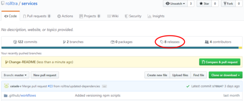
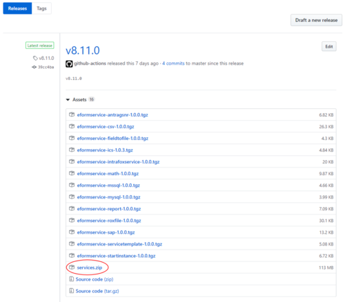
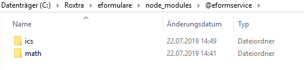

# services

## Language

[English](#use-existing-services)  
[Deutsch](#benutzen-von-bereits-vorhandenen-services)

## Use existing Services

1. ### Download Services

To use existing sample services you need to download the builded versions of services from the [releases section](https://github.com/roXtra/services/releases) of this GitHub
repository.



Download the service.zip of your corresponding roXtra version. This zip contains all services that are currently released for this version.



2. ### Install a Service

Once you have downloaded the services.zip of the roXtra version you use extract the service you want in the Roxtra/eformulare/node_modules/@eformservice directory of your
roXtra application server.  
Create this folder if it doesn't exist.



3. ### (Optional) Service configuration via `config.json`

Some services allow configuration using a `config.json` configuration file. Example:

```json
{
  "secret": {
    "mytoken": "value"
  }
}
```

In this configuration file, you can securely store authentication tokens on the server for supported services and use them with the variable `secret['mytoken']` in the service
configuration in the user interface.

The configuration options vary by service. Services that support this configuration file contain a `configtemplate.json` file that serves as a template and has to be renamed
to `config.json` for use.

4. ### Restart

To run your new service you have to restart your roXtraEFormulare Windows Service.

## Develop your own Services

### Note

If you implement a service yourself, you must also ensure that the service is kept up to date. Before a roXtra system update of the productive system, you should install the
corresponding processhub-sdk version (same version number as the roXtra update) in the service and check it for functionality on a test system.

### Requirements

- [Node.js](https://nodejs.org/en/download/)

### Getting Started

- Clone the repository
- Open it in VSCode or in your preferred IDE
- Install all dependencies via
  ```javascript
  npm install
  ```
- Execute the following command to build the existing services
  ```javascript
  npm run buildbundle
  ```

If you followed these steps, a services.zip has been created in the root directory containing all zipped services. Now you are ready to install or develop your own services.

### Write your own Service

Services are written in TypeScript.  
To build and run a service, several files are required:

- package.json, to specify the dependencies
- tsconfig.json, to specify compile options
- .eslintrc.json, to specify lint options

The following files contain code for the service you want to develop:

- service.json, defines the basic structure of the service
- \<myservicename\>-config.tsx, contains React code that defines the appearance of the service
- \<myservicename\>-service.ts, defines the behavior of the service

To get a basic understanding for developing services, feel free to look into our existing services in the repository. We should have you covered with a template service under
./servicetemplate.

## Benutzen von bereits vorhandenen Services

1. ### Herunterladen von Services

Um einen bereits vorhandenen Beispiel Service zu nutzen, müssen Sie diesen herunterladen. Dies können Sie unter dem Reiter
[releases](https://github.com/roXtra/services/releases) dieses GitHub Repositories tun.


Laden Sie sich die services.zip Ihrer installierten roXtra Version herunter. Diese zip-Datei enthält alle Services die zurzeit für diese Version veröffentlicht sind.


2. ### Installieren eines Services

Nachdem Sie die services.zip Ihrer roXtra Version heruntergeladen haben extrahieren Sie den Service, den Sie installieren möchten, in das
Roxtra/eformulare/node_modules/@eformservice Verzeichnis auf Ihrem roXtra Applikationsserver. Ggf. muss der Ordner @eformservice von Ihnen erstellt werden.


3. ### (Optional) Konfiguration des Services via `config.json`

Einige Services erlauben eine Konfiguration mittels einer `config.json` Konfigurationsdatei. Beispiel:

```json
{
  "secret": {
    "mytoken": "value"
  }
}
```

In diese Konfigurationsdatei können Sie für unterstützte Services beispielsweise Authentifizierungs-Tokens sicher auf dem Server abgelegen und anschließend mit der Variablen
`secret['mytoken']` in der Servicekonfiguration über die Benutzeroberfläche verwenden.

Die Möglichkeiten unterscheiden sich pro Service. Services, die diese Konfigurationsdatei unterstützen, enthalten eine `configtemplate.json` Datei, die als Vorlage dient und
zur Verwendung in `config.json` umbenannt werden muss.

4. ### Neustart

Um Ihren neu installierten Service zu verwenden starten Sie Ihren roXtraEFormulare Windows Dienst neu.

## Entwickeln von Services

### Hinweis

Sollten Sie einen Service selbst implementieren, müssen Sie auch darauf achten den Service aktuell zu halten. Vor einem roXtra Systemupdate des Produktivsystems sollten Sie
die dazugehörige processhub-sdk Version (gleiche Versionsnummer wie das roXtra Update) im Service installieren und auf einem Testsystem auf Funktionalität überprüfen.

### Voraussetzungen

- [Node.js](https://nodejs.org/de/download/)

### Erste Schritte

- Klonen Sie das Repository
- Öffnen Sie es in VSCode oder in Ihrer bevorzugten Entwicklungsumgebung
- Installieren Sie alle Abhängigkeiten mit dem folgenden Konsolenbefehl
  ```javascript
  npm install
  ```
- Führen Sie den folgenden Befehl aus, um alle vorhandenen Services zu bauen
  ```javascript
  npm run buildbundle
  ```

Wenn Sie diese Schritte befolgt haben, wurde eine services.zip mit allen Services im Stammverzeichnis erstellt. Jetzt sind Sie bereit Ihre eigenen Services zu entwickeln.

### Schreiben Sie Ihren eigenen Service

Services sind in der Programmiersprache TypeScript geschrieben.  
Ein Service benötigt verschiedene Dateien:

- package.json, um die Abhängigkeiten zu definieren
- tsconfig.json, um Compiler Optionen zu definieren
- .eslintrc.json, um Linter Optionen zu definieren

Die folgenden Dateien können für Ihren Service angepasst werden:

- service.json, definiert die grundlegende Struktur Ihres Services
- \<myservicename\>-config.tsx, enthält React Code, der das Aussehen Ihres Services bestimmt
- \<myservicename\>-service.ts, bestimmt das Verhalten Ihres Services

Für ein grundlegendes Verständnis der Service Entwicklung, können Sie gerne einen Blick in die bereits vorhandenen Services in diesem Repository werfen.
